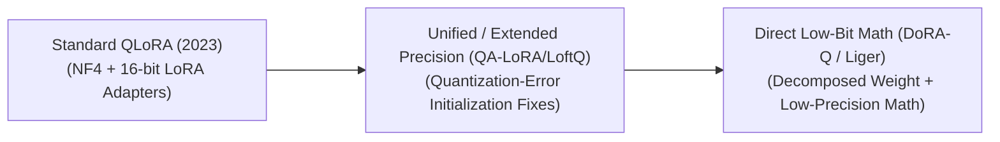

# Awesome-QLoRA
## Quantized Low-Rank Adaptation (QLoRA): Evolution, Variants, & Applications

Quantized Low-Rank Adaptation (QLoRA) is an advanced memory-efficient Parameter-Efficient Fine-Tuning (PEFT) framework. Introduced by Dettmers et al. in 2023, QLoRA revolutionized model customization by enabling the fine-tuning of massive foundation models (up to 70B parameters) on a single consumer-grade 48GB GPU without any performance degradation. It achieves this by freezing the base model into a highly compressed 4-bit data type and injecting tiny, high-precision 16-bit Low-Rank Adaptation (LoRA) weight tensors that compute gradients during backpropagation.

---

## 1. The Core Architectural Innovations

The baseline QLoRA framework achieves its massive memory savings by combining three distinct hardware-aware and mathematical techniques.

| Technique | Mechanism | Significance | Year First Used | Paper Link |
| :--- | :--- | :--- | :--- | :--- |
| [**4-bit NormalFloat (NF4) Data Type**](pages/nf4.md) | A non-uniform quantization data type inherently optimized for normally distributed data. | Quantizes weights such that each bin has an equal number of expected parameters, yielding significantly better information retention than standard 4-bit Integers (INT4) or 4-bit Floats (FP4). | 2023 | [QLoRA: Efficient Finetuning of Quantized LLMs](https://arxiv.org/abs/2305.14314) |
| [**Double Quantization (DQ)**](pages/dq.md) | Re-quantizes the quantization constants (the scaling factors) generated during the primary model compression step. | Compresses the quantization metadata itself from 32-bit floats down to 8-bit blocks, saving an average of 0.37 bits per parameter (~3GB of VRAM savings for a 65B model). | 2023 | [QLoRA: Efficient Finetuning of Quantized LLMs](https://arxiv.org/abs/2305.14314) |
| [**Paged Optimizers**](pages/paged_optimizers.md) | Integrates with NVIDIA unified memory management to execute page-to-page memory transfers between the GPU VRAM and CPU RAM. | Acts as a memory safety net. It prevents Out-Of-Memory (OOM) errors during heavy activation spikes or processing long context lengths by temporarily evicting data to system RAM. | 2023 | [QLoRA: Efficient Finetuning of Quantized LLMs](https://arxiv.org/abs/2305.14314) |

---

## 2. The Chronological Evolution & Variants

Since its launch, the open-source community and research teams have iteratively expanded QLoRA's core mathematical and system-level architecture.

| Variant | Concept | Year First Used | Paper Link |
| :--- | :--- | :--- | :--- |
| [**The Baseline Framework (Dettmers et al., 2023)**](pages/baseline.md) | Frozen 4-bit NF4 base model paired with 16-bit FP16/BF16 linear layer low-rank matrices ($A$ and $B$). Quantized weights are dynamically de-quantized to 16-bit in cache memory during the forward and backward passes. | 2023 | [QLoRA: Efficient Finetuning of Quantized LLMs](https://arxiv.org/abs/2305.14314) |
| [**Initialization & Quantization Alignment (QA-LoRA / LoftQ, ~2023–2024)**](pages/qa_lora.md) | Solved the quantization error gap at step zero. **LoftQ** applies an alternating optimization framework that simultaneously discovers the best low-bit base initialization alongside matching low-rank adapter weights. **QA-LoRA** introduces group-wise quantization specifically tailored to speed up subsequent inference tracking. | 2023 | [QA-LoRA](https://arxiv.org/abs/2309.14717) / [LoftQ](https://arxiv.org/abs/2310.08659) |
| [**Weight Decomposition Adaptations (DoRA + QLoRA, ~2024–Present)**](pages/dora.md) | Combines **Weight-Decomposed Low-Rank Adaptation (DoRA)** with QLoRA's 4-bit NF4 backbone. It breaks the parameter changes down into distinct magnitude and direction arrays, applying low-rank calculations strictly to directional components, significantly boosting mathematical convergence. | 2024 | [DoRA: Weight-Decomposed Low-Rank Adaptation](https://arxiv.org/abs/2402.09353) |

---

## 3. Structural Scaling & Implementation Types

Developers deploy QLoRA through several framework abstractions depending on the scale of processing infrastructure and hardware targets.

| Implementation | Description | Year First Used | Paper Link |
| :--- | :--- | :--- | :--- |
| [**PEFT + BitsAndBytes (The Reference Pipeline)**](pages/peft_bnb.md) | *Implementation:* The baseline python implementation via Hugging Face. Leverages the `bitsandbytes` library to execute low-level CUDA kernels for NF4 casting and real-time SRAM de-quantization. | 2023 | [QLoRA: Efficient Finetuning of Quantized LLMs](https://arxiv.org/abs/2305.14314) |
| [**Unsloth Optimized QLoRA**](pages/unsloth.md) | *Implementation:* Highly tuned, custom handwritten OpenAI Triton kernels that replace the standard PyTorch autograd engine. *Pros:* Accelerates QLoRA training speeds by up to 2–5$\times$ and reduces auxiliary activation memory footprints by an additional 60-80% without modifying final weights. | 2023 | [Unsloth GitHub Repository](https://github.com/unslothai/unsloth) |
| [**Axolotl / DeepSpeed ZeRO-3 QLoRA**](pages/axolotl.md) | *Implementation:* Multi-node, distributed multi-GPU configuration setups. It shards the 4-bit frozen parameters and active optimizer states cleanly across clusters to fine-tune 405B+ models efficiently. | 2023 | [ZeRO: Memory Optimizations Toward Training Trillion Parameter Models](https://arxiv.org/abs/1910.02054) |

---

## 4. Production & Downstream Applications

| Application | Description | Year First Used | Paper Link |
| :--- | :--- | :--- | :--- |
| [**Consumer-Grade Local Finetuning Hubs**](pages/local_hubs.md) | *Application:* Tools like `Ollama`, `LM Studio`, or local Jupyter notebooks let independent software engineers train customized 8B to 32B models directly on a single consumer laptop or desktop GPU (e.g., RTX 3090/4090) overnight. | 2023 | N/A |
| [**Enterprise Domain Adaptation Sprints**](pages/enterprise.md) | *Application:* Corporations ingest specialized private datasets (legal briefs, internal medical charts) to adapt base foundation models. QLoRA acts as a cheap, rapid prototyping layer before committing to full-scale fine-tuning pipelines. | 2023 | [QLoRA: Efficient Finetuning of Quantized LLMs](https://arxiv.org/abs/2305.14314) |
| [**On-Device Edge Robotic Alignment**](pages/edge.md) | *Application:* Embedded systems and industrial autonomous machinery update operational vision-language navigation policies locally using edge-case data, computing updates within highly restricted hardware thermal limits. | 2023 | N/A |

